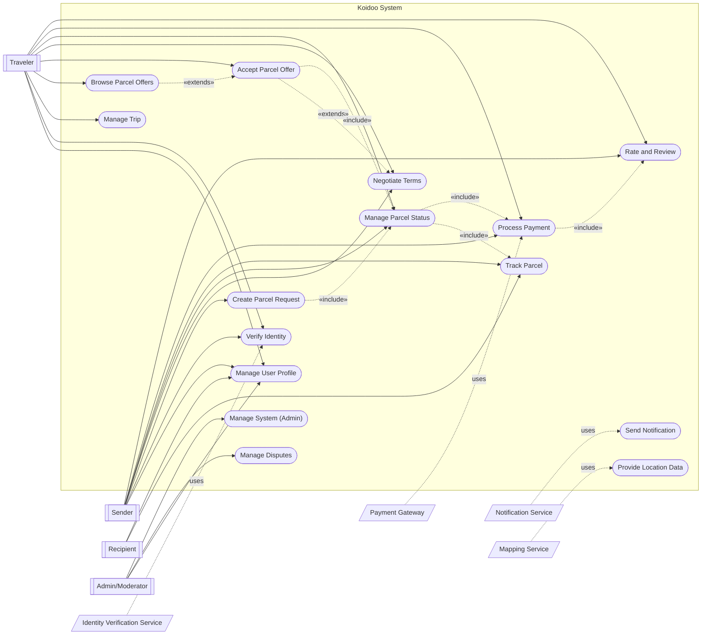
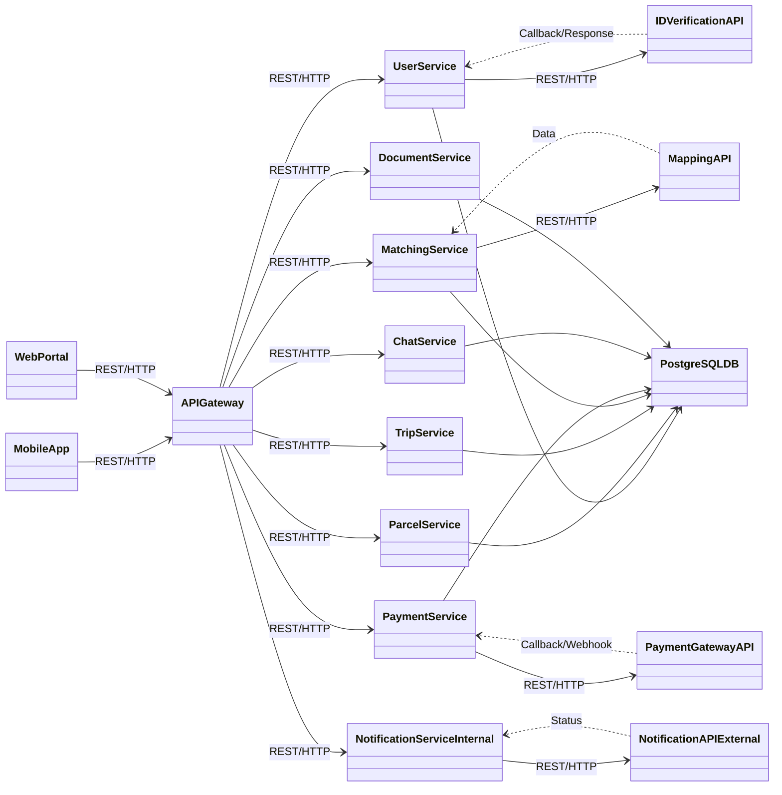
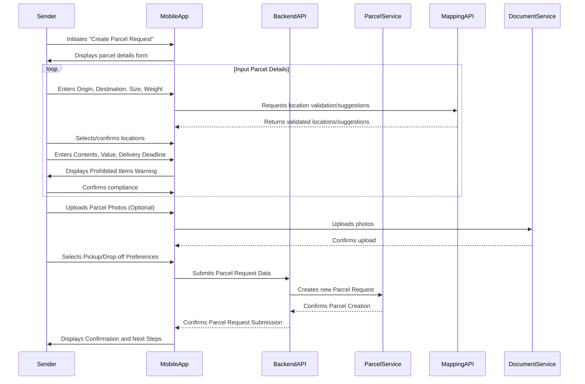
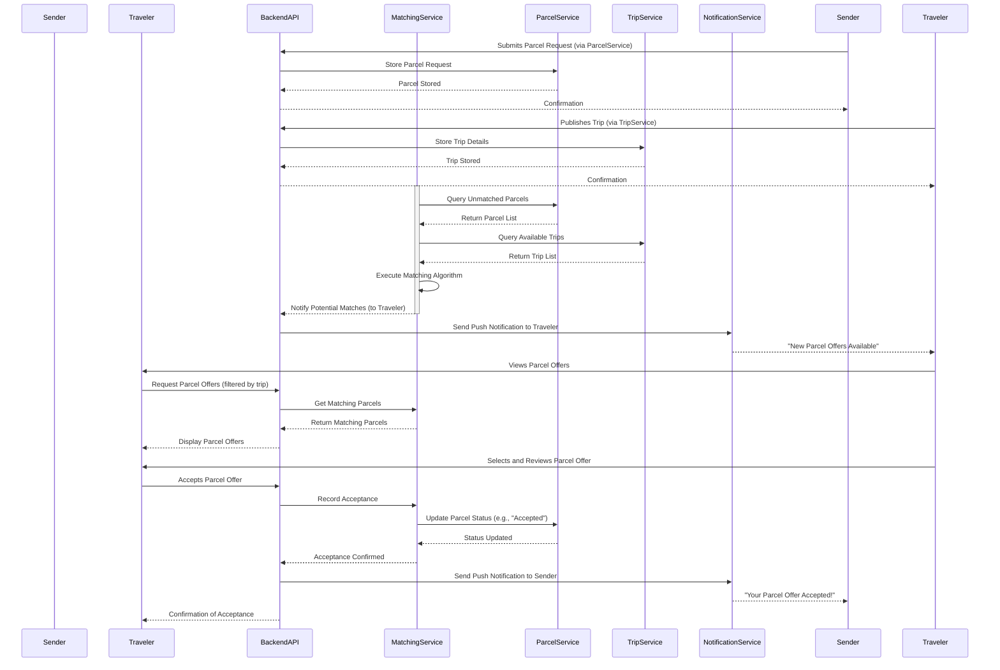
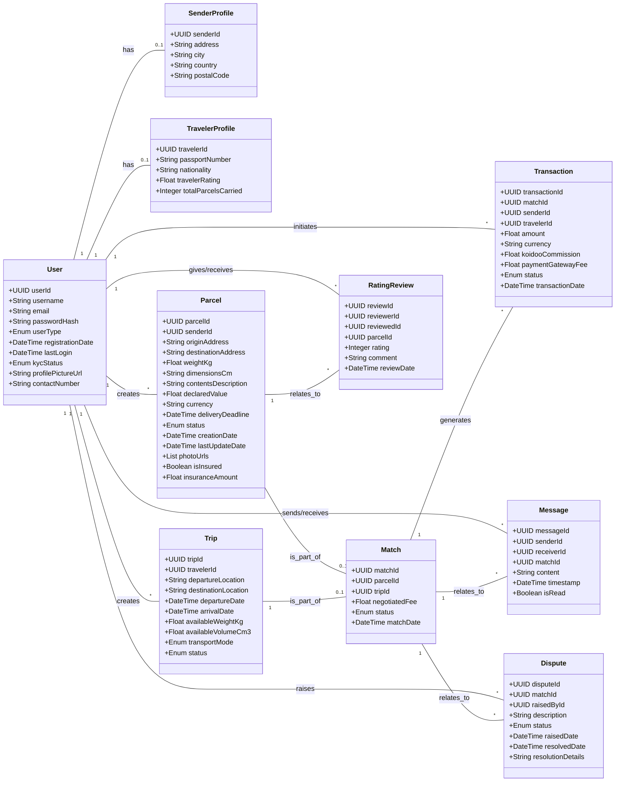
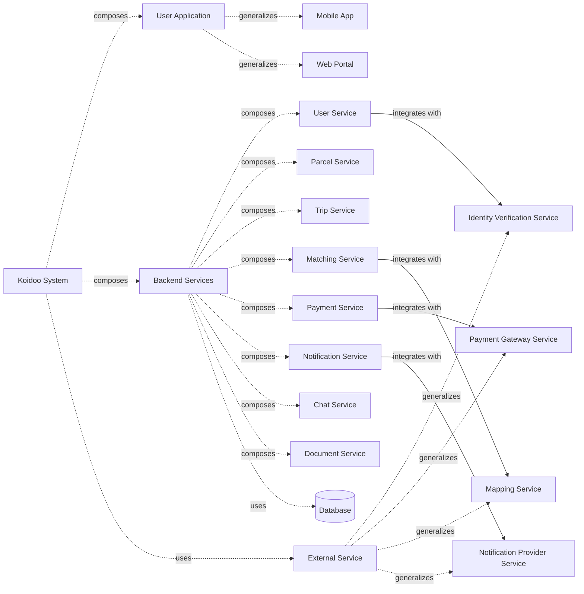
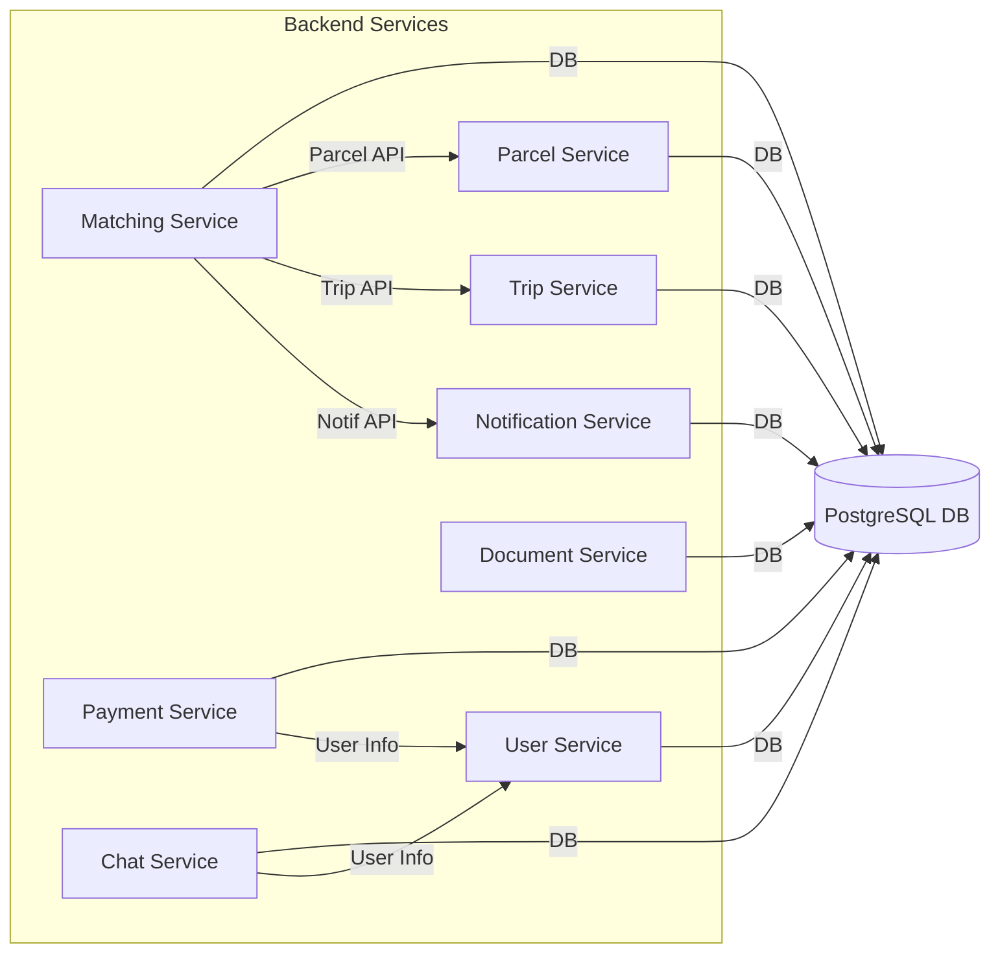
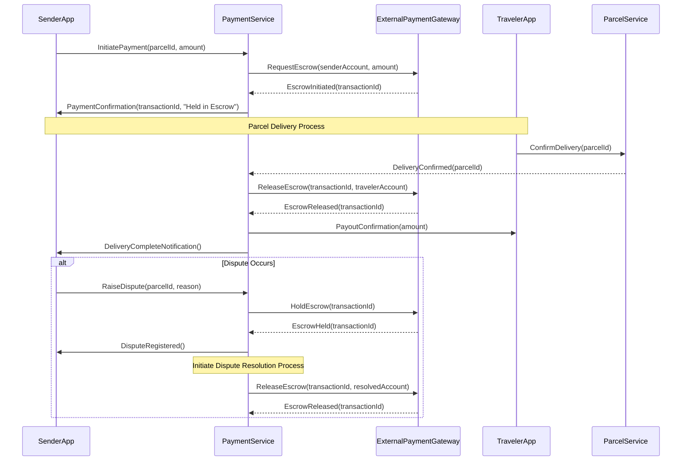
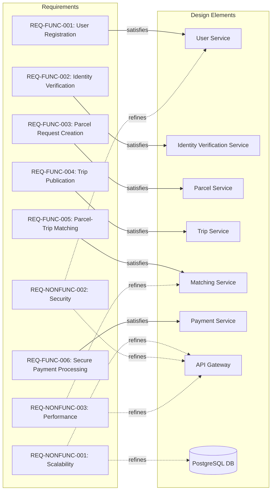

# Koidoo: System Design and Conception

## 1. Introduction

This document details the comprehensive design and conception of the Koidoo peer-to-peer parcel delivery platform. It translates the business requirements and technical architecture overview into detailed system designs using Unified Modeling Language (UML) and Systems Modeling Language (SysML) diagrams. The aim is to provide a clear, unambiguous, and complete blueprint for the development and implementation of the Koidoo application, ensuring all stakeholders have a shared understanding of the system's structure, behavior, and relationships.

## 2. High-Level System Architecture

This section presents the foundational architectural views of the Koidoo system, illustrating its primary actors, core functionalities, and major components. These diagrams provide a high-level understanding of 'what' the system does and 'what' its main building blocks are.

### 2.1. UML Use Case Diagram

The Use Case Diagram illustrates the interactions between the primary actors and the Koidoo system, representing the system's functional requirements from an external perspective. It identifies the main functionalities offered by the system and how different types of users interact with them.

**Actors:**
*   **Sender:** An individual or small business that wants to send a parcel internationally.
*   **Traveler:** An individual who has available luggage space and is willing to carry parcels for a fee.
*   **Recipient:** The person who receives the parcel at the destination.
*   **Admin/Moderator:** Koidoo platform staff responsible for system management, user support, and compliance.
*   **Payment Gateway:** An external system responsible for processing financial transactions.
*   **Identity Verification Service:** An external system responsible for verifying user identities.
*   **Notification Service:** An external system responsible for sending notifications (SMS, Email, Push).
*   **Mapping Service:** An external system providing location and routing functionalities.

**Use Cases:**
*   **Manage User Profile:** Actors (Sender, Traveler, Recipient, Admin) can create, view, update, and delete their profiles.
*   **Verify Identity:** Sender and Traveler undergo identity verification.
*   **Create Parcel Request:** Sender initiates a request to send a parcel.
*   **Manage Trip:** Traveler publishes and manages their travel plans and available luggage space.
*   **Browse Parcel Offers:** Traveler views available parcel requests matching their trip.
*   **Accept Parcel Offer:** Traveler agrees to carry a specific parcel.
*   **Negotiate Terms:** Sender and Traveler can negotiate delivery terms (e.g., fee, pickup/drop-off details).
*   **Manage Parcel Status:** Sender and Traveler update the status of a parcel (e.g., picked up, in transit, delivered).
*   **Track Parcel:** Sender and Recipient can monitor the real-time status and location of a parcel.
*   **Process Payment:** Payment Gateway handles the escrow and release of funds upon successful delivery.
*   **Manage Disputes:** Admin/Moderator handles disagreements between Sender and Traveler.
*   **Send Notification:** Notification Service sends alerts to users.
*   **Provide Location Data:** Mapping Service provides location and routing information.
*   **Rate and Review:** Sender and Traveler provide feedback on each other after a transaction.
*   **Manage System (Admin):** Admin/Moderator performs administrative tasks like user management, content moderation, and system configuration.

### 2.2. UML Component Diagram

The Component Diagram illustrates the high-level structure of the Koidoo system, showing the major software components and their interfaces. It provides a modular view of the system, highlighting how different parts interact to deliver the overall functionality.

**Components:**
*   **Mobile App (Frontend):** User-facing application for iOS and Android (React Native).
*   **Web Portal (Frontend):** Web-based interface for admin and limited user access (React).
*   **API Gateway:** Entry point for all client requests, routing to appropriate microservices.
*   **User Service:** Manages user profiles, authentication, and KYC.
*   **Parcel Service:** Manages parcel creation, details, and status.
*   **Trip Service:** Manages traveler trip publications and available space.
*   **Matching Service:** Implements the core logic for matching parcels with trips.
*   **Payment Service:** Handles all payment-related operations, including escrow.
*   **Notification Service:** Manages sending various types of notifications.
*   **Chat Service:** Provides in-app messaging functionality.
*   **Document Service:** Manages secure storage and access to user documents.
*   **PostgreSQL Database:** Persistent storage for all application data.
*   **Identity Verification API:** External service for identity verification.
*   **Payment Gateway API:** External service for payment processing.
*   **Mapping API:** External service for location and routing.
*   **Notification API:** External service for sending push, SMS, and email notifications.

## 3. User Interaction Flows

This section details the dynamic behavior of the Koidoo system, illustrating how users interact with the platform to achieve their goals. UML Activity Diagrams will show the flow of activities, while UML Sequence Diagrams will depict the interactions between objects in a time-ordered sequence.

### 3.1. UML Activity Diagram: Create Parcel Request

This activity diagram illustrates the process a Sender follows to create a parcel request on the Koidoo platform.

### 3.2. UML Sequence Diagram: Parcel Matching and Acceptance

This sequence diagram illustrates the interaction between the Sender, Traveler, and various system components during the parcel matching and acceptance process.

## 4. Design Data Model (UML Class Diagram)

This section defines the static structure of the Koidoo system, illustrating the main entities (classes), their attributes, and the relationships between them. The UML Class Diagram provides a blueprint for the database schema and the object-oriented design of the application.

**Key Entities (Classes):**
*   **User:** Represents a registered user of the Koidoo platform. Can be a Sender, Traveler, or Admin.
    *   `userId: UUID` (Primary Key)
    *   `username: String`
    *   `email: String`
    *   `passwordHash: String`
    *   `userType: Enum (Sender, Traveler, Admin)`
    *   `registrationDate: DateTime`
    *   `lastLogin: DateTime`
    *   `kycStatus: Enum (Pending, Verified, Rejected)`
    *   `profilePictureUrl: String`
    *   `contactNumber: String`
*   **SenderProfile:** Specific attributes for a Sender.
    *   `senderId: UUID` (Primary Key, Foreign Key to User)
    *   `address: String`
    *   `city: String`
    *   `country: String`
    *   `postalCode: String`
*   **TravelerProfile:** Specific attributes for a Traveler.
    *   `travelerId: UUID` (Primary Key, Foreign Key to User)
    *   `passportNumber: String`
    *   `nationality: String`
    *   `travelerRating: Float`
    *   `totalParcelsCarried: Integer`
*   **Parcel:** Represents a parcel to be sent.
    *   `parcelId: UUID` (Primary Key)
    *   `senderId: UUID` (Foreign Key to User)
    *   `originAddress: String`
    *   `destinationAddress: String`
    *   `weightKg: Float`
    *   `dimensionsCm: String` (e.g., "LxWxH")
    *   `contentsDescription: String`
    *   `declaredValue: Float`
    *   `currency: String`
    *   `deliveryDeadline: DateTime`
    *   `status: Enum (Pending, Matched, PickedUp, InTransit, Delivered, Cancelled, Disputed)`
    *   `creationDate: DateTime`
    *   `lastUpdateDate: DateTime`
    *   `photoUrls: List<String>`
    *   `isInsured: Boolean`
    *   `insuranceAmount: Float`
*   **Trip:** Represents a traveler's planned trip.
    *   `tripId: UUID` (Primary Key)
    *   `travelerId: UUID` (Foreign Key to User)
    *   `departureLocation: String`
    *   `destinationLocation: String`
    *   `departureDate: DateTime`
    *   `arrivalDate: DateTime`
    *   `availableWeightKg: Float`
    *   `availableVolumeCm3: Float`
    *   `transportMode: Enum (Flight, Train, Car, etc.)`
    *   `status: Enum (Active, Completed, Cancelled)`
*   **Match:** Represents a successful match between a Parcel and a Trip.
    *   `matchId: UUID` (Primary Key)
    *   `parcelId: UUID` (Foreign Key to Parcel)
    *   `tripId: UUID` (Foreign Key to Trip)
    *   `negotiatedFee: Float`
    *   `status: Enum (Pending, Accepted, Rejected, Confirmed)`
    *   `matchDate: DateTime`
*   **Transaction:** Records financial transactions.
    *   `transactionId: UUID` (Primary Key)
    *   `matchId: UUID` (Foreign Key to Match)
    *   `senderId: UUID` (Foreign Key to User)
    *   `travelerId: UUID` (Foreign Key to User)
    *   `amount: Float`
    *   `currency: String`
    *   `koidooCommission: Float`
    *   `paymentGatewayFee: Float`
    *   `status: Enum (Pending, HeldInEscrow, ReleasedToTraveler, Refunded)`
    *   `transactionDate: DateTime`
*   **RatingReview:** Stores ratings and reviews between users.
    *   `reviewId: UUID` (Primary Key)
    *   `reviewerId: UUID` (Foreign Key to User)
    *   `reviewedId: UUID` (Foreign Key to User)
    *   `parcelId: UUID` (Foreign Key to Parcel, Optional)
    *   `rating: Integer (1-5)`
    *   `comment: String`
    *   `reviewDate: DateTime`
*   **Message:** Stores chat messages.
    *   `messageId: UUID` (Primary Key)
    *   `senderId: UUID` (Foreign Key to User)
    *   `receiverId: UUID` (Foreign Key to User)
    *   `matchId: UUID` (Foreign Key to Match)
    *   `content: String`
    *   `timestamp: DateTime`
    *   `isRead: Boolean`
*   **Dispute:** Records and manages disputes.
    *   `disputeId: UUID` (Primary Key)
    *   `matchId: UUID` (Foreign Key to Match)
    *   `raisedById: UUID` (Foreign Key to User)
    *   `description: String`
    *   `status: Enum (Open, UnderReview, Resolved, Closed)`
    *   `raisedDate: DateTime`
    *   `resolvedDate: DateTime`
    *   `resolutionDetails: String`

## 5. Design System Decomposition and Interfaces (SysML BDD, IBD)

This section delves into the system's structure from a SysML perspective, focusing on the definition of system blocks and their internal composition and interconnections. SysML Block Definition Diagrams (BDD) define the types of blocks and their relationships, while Internal Block Diagrams (IBD) show the internal structure of a block in terms of its parts, ports, and connectors.

### 5.1. SysML Block Definition Diagram (BDD): System Context and Main Blocks

This BDD illustrates the top-level system context of Koidoo and defines its primary functional and physical blocks, along with their relationships (e.g., composition, association, generalization).

**Blocks:**
*   **KoidooSystem:** The top-level system block representing the entire Koidoo platform.
*   **UserApplication:** Abstract block for user-facing applications (MobileApp, WebPortal).
*   **MobileApp:** Specific block for iOS/Android mobile applications.
*   **WebPortal:** Specific block for the web-based interface.
*   **BackendServices:** Abstract block for all backend microservices.
*   **UserService:** Manages user-related functionalities.
*   **ParcelService:** Manages parcel-related functionalities.
*   **TripService:** Manages trip-related functionalities.
*   **MatchingService:** Handles the core matching logic.
*   **PaymentService:** Manages payment transactions.
*   **NotificationService:** Manages notifications.
*   **ChatService:** Manages in-app chat.
*   **DocumentService:** Manages document storage.
*   **Database:** Persistent data storage.
*   **ExternalService:** Abstract block for all external third-party integrations.
*   **IdentityVerificationService:** External service for KYC.
*   **PaymentGatewayService:** External service for payment processing.
*   **MappingService:** External service for location and mapping.
*   **NotificationProviderService:** External service for sending notifications (e.g., FCM, Twilio).

### 5.2. SysML Internal Block Diagram (IBD): Backend Services

This IBD shows the internal structure of the `BackendServices` block, detailing its constituent parts (microservices), their ports, and the connectors that define their interactions. This provides a more granular view of the backend's internal communication.

**Parts (Microservices):**
*   `userSvc: UserService`
*   `parcelSvc: ParcelService`
*   `tripSvc: TripService`
*   `matchingSvc: MatchingService`
*   `paymentSvc: PaymentService`
*   `notificationSvc: NotificationService`
*   `chatSvc: ChatService`
*   `documentSvc: DocumentService`
*   `db: Database`

**Ports and Interfaces:**
*   Each service exposes an API (e.g., `apiPort`) for external communication (from API Gateway) and internal communication (between services).
*   Database access is through a `dbPort`.

**Connectors:**
*   Represent communication pathways (e.g., RESTful API calls, message queues).

## 6. Model System Behavior (SysML Activity, Sequence Diagrams)

This section describes the dynamic behavior of the Koidoo system from a SysML perspective, focusing on the flow of control and data between system blocks and their internal parts. SysML Activity Diagrams are used to model the sequence of actions and decisions, while SysML Sequence Diagrams illustrate the time-ordered exchange of messages between interacting blocks.

### 6.1. SysML Activity Diagram: Parcel Delivery Lifecycle

This SysML Activity Diagram models the end-to-end lifecycle of a parcel delivery within the Koidoo system, highlighting the activities performed by different system blocks and external services. It provides a comprehensive view of the process from parcel creation to final delivery and payment release.

```mermaid
%% Parcel Delivery Lifecycle – Koidoo System
flowchart LR
    %% Koidoo internal components
    subgraph Koidoo_System["Koidoo System"]
        SenderApp["Sender Application"]
        TravelerApp["Traveler Application"]
        BackendAPI["Backend API"]
        ParcelService["Parcel Service"]
        TripService["Trip Service"]
        MatchingService["Matching Service"]
        PaymentService["Payment Service"]
        NotificationService["Notification Service"]
    end
    ExternalPaymentGateway["External Payment Gateway"]

    %% Activity flow
    StartNode((Start)) --> CreateParcelRequest["Create Parcel Request"]
    CreateParcelRequest --> SubmitParcelRequest["Submit Parcel Request"]
    SubmitParcelRequest --> FindMatchingTraveler["Find Matching Traveler"]
    FindMatchingTraveler --> OfferParcelToTraveler["Offer Parcel to Traveler"]
    OfferParcelToTraveler --> AcceptParcelOffer["Accept Parcel Offer"]
    AcceptParcelOffer --> ArrangePickup["Arrange Pickup"]
    ArrangePickup --> ParcelPickedUp["Parcel Picked Up"]
    ParcelPickedUp --> InTransit["In Transit"]
    InTransit --> ParcelDelivered["Parcel Delivered"]
    ParcelDelivered --> ConfirmDelivery["Confirm Delivery"]
    ConfirmDelivery --> ReleasePayment["Release Payment"]
    ReleasePayment --> EndNode((End))

    %% Component interactions along the flow
    SenderApp -->|Initiates| CreateParcelRequest
    CreateParcelRequest --> BackendAPI
    BackendAPI --> SubmitParcelRequest
    SubmitParcelRequest --> ParcelService
    ParcelService --> FindMatchingTraveler
    FindMatchingTraveler --> MatchingService
    MatchingService --> OfferParcelToTraveler
    OfferParcelToTraveler --> TravelerApp
    TravelerApp --> AcceptParcelOffer
    AcceptParcelOffer --> BackendAPI
    BackendAPI --> ArrangePickup
    ArrangePickup --> TravelerApp
    TravelerApp --> ParcelPickedUp
    ParcelPickedUp --> BackendAPI
    BackendAPI --> InTransit
    InTransit --> BackendAPI
    BackendAPI --> ParcelDelivered
    ParcelDelivered --> SenderApp
    SenderApp --> ConfirmDelivery
    ConfirmDelivery --> BackendAPI
    BackendAPI --> ReleasePayment
    ReleasePayment --> PaymentService
    PaymentService -->|Escrow/Release| ExternalPaymentGateway
    ExternalPaymentGateway -->|Funds Released| ReleasePayment

```

### 6.2. SysML Sequence Diagram: Payment Processing with Escrow

This SysML Sequence Diagram illustrates the detailed message exchange during the payment processing, focusing on the escrow mechanism and the interactions between the Payment Service, External Payment Gateway, and other relevant system blocks.

## 7. Establish Requirements Traceability (SysML Requirements Diagram)

This section focuses on ensuring that all identified requirements are addressed by the system design. A SysML Requirements Diagram visually links requirements to the design elements that satisfy them, providing clear traceability and facilitating impact analysis for changes.

**Key Requirements (Examples):**
*   **REQ-FUNC-001: User Registration:** The system shall allow users to register and create a profile.
*   **REQ-FUNC-002: Identity Verification:** The system shall require users to verify their identity (KYC).
*   **REQ-FUNC-003: Parcel Request Creation:** The system shall enable senders to create parcel requests with detailed specifications.
*   **REQ-FUNC-004: Trip Publication:** The system shall enable travelers to publish their trip details and available luggage space.
*   **REQ-FUNC-005: Parcel-Trip Matching:** The system shall automatically match parcel requests with suitable trips.
*   **REQ-FUNC-006: Secure Payment Processing:** The system shall facilitate secure escrow-based payment processing.
*   **REQ-NONFUNC-001: Scalability:** The system shall be scalable to support 100,000 concurrent users.
*   **REQ-NONFUNC-002: Security:** The system shall protect user data and transactions from unauthorized access.
*   **REQ-NONFUNC-003: Performance:** The system shall respond to user requests within 2 seconds for 90% of interactions.

**Design Elements (Examples):**
*   **User Service:** Responsible for user registration and profile management.
*   **Identity Verification Service:** Integrates with external KYC providers.
*   **Parcel Service:** Manages parcel data and requests.
*   **Trip Service:** Manages trip data and publications.
*   **Matching Service:** Implements the matching algorithm.
*   **Payment Service:** Handles payment logic and escrow.
*   **API Gateway:** Ensures secure and scalable access to backend services.
*   **PostgreSQL DB:** Provides persistent and scalable data storage.

## 8. Conclusion

This document has provided a comprehensive design and conception of the Koidoo peer-to-peer parcel delivery platform, leveraging both UML and SysML diagrams. From high-level use cases and component interactions to detailed data models, system decomposition, behavioral modeling, and requirements traceability, every effort has been made to create a clear and actionable blueprint for development. This detailed design ensures that the Koidoo system will be robust, scalable, secure, and aligned with its core business objectives, ultimately delivering a seamless and trustworthy experience for all users.

## 9. References

*   [1] Koidoo Project Overview: [./wakadoo_improved_overview.md](./wakadoo_improved_overview.md)
*   [2] Koidoo Technical Architecture Document: [./koidoo_technical_architecture.md](./koidoo_technical_architecture.md)
*   [3] UML (Unified Modeling Language) Official Site: [https://www.uml.org/](https://www.uml.org/)
*   [4] SysML (Systems Modeling Language) Official Site: [https://www.omg.org/sysml/](https://www.omg.org/sysml/)

